# PIM5 - API de Predicción con FastAPI y Docker

## Descripción del proyecto

Este proyecto tiene como objetivo disponibilizar un modelo de Machine Learning mediante una API desarrollada con FastAPI y desplegada utilizando Docker.

El desarrollo forma parte del Proyecto Integrador del Módulo 5 de la carrera de Data Science en Henry y busca integrar conceptos de:

* Machine Learning
* APIs
* Docker
* Control de versiones con Git
* Pull Requests
* Versionado semántico
* Integración Continua con GitHub Actions

---

# Estructura del proyecto

```bash
PIM5_v1/
│
├── .github/
│   └── workflows/
│       └── test.yml
│
├── img/
│
├── src/
│   ├── api/
│   │   └── main.py
│   │
│   ├── models/
│   │   ├── model.joblib
│   │   └── train_model.py
│   │
│   ├── schemas/
│   │   └── user_data.py
│   │
│   ├── cargar_datos.py
│   └── comprension_EDA.ipynb
│
├── Dockerfile
├── requirements.txt
├── README.md
├── set_up.bat
└── Base_de_datos.xlsx
```

---

# Entrenamiento del modelo

El modelo fue entrenado utilizando Scikit-Learn y posteriormente serializado mediante Joblib para ser reutilizado desde la API.

Archivo del modelo:

```bash
src/models/model.joblib
```

Script de entrenamiento:

```bash
src/models/train_model.py
```

---

# Desarrollo de la API con FastAPI

La API fue desarrollada utilizando FastAPI, permitiendo exponer el modelo mediante endpoints HTTP.

La documentación automática se genera con Swagger UI.

## Ejecución local

```bash
uvicorn src.api.main:app --reload --port 5000
```

## Documentación Swagger

```text
http://127.0.0.1:5000/docs
```

### Evidencia de creación de la API

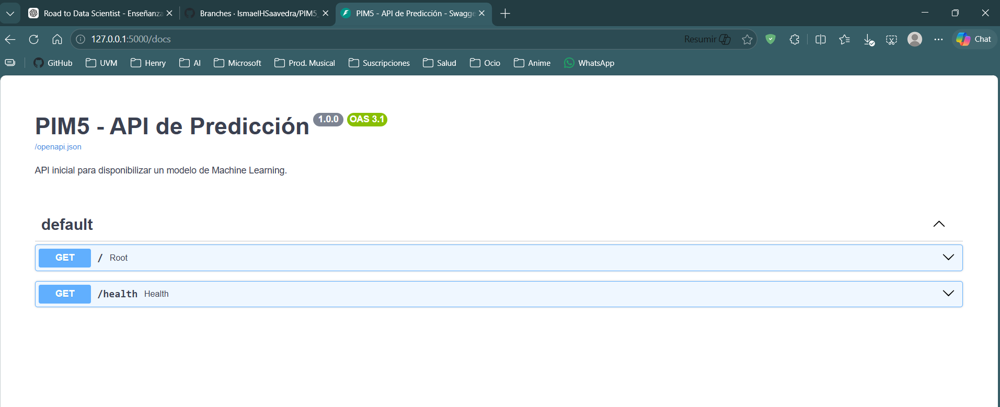

### Swagger funcionando correctamente

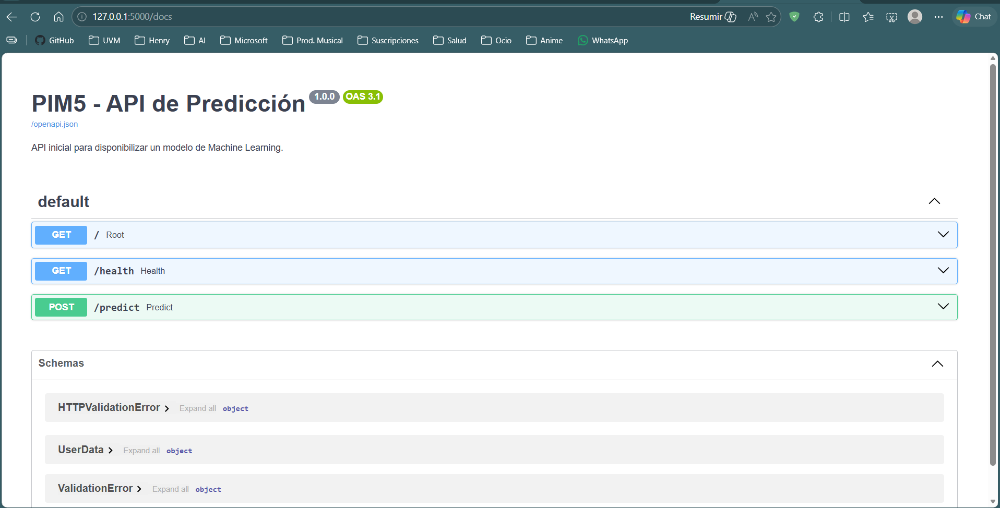

---

# Endpoint principal

## POST `/predict`

El endpoint recibe información del cliente en formato JSON y devuelve la predicción generada por el modelo.

Ejemplo de entrada:

```json
{
    "edad_cliente": 50,
    "salario_cliente": 30000,
    "capital_prestado": 70000,
    "plazo_meses": 48
}
```

Ejemplo de respuesta:

```json
{
    "prediction": 1
}
```

### Evidencia de predicción realizada correctamente

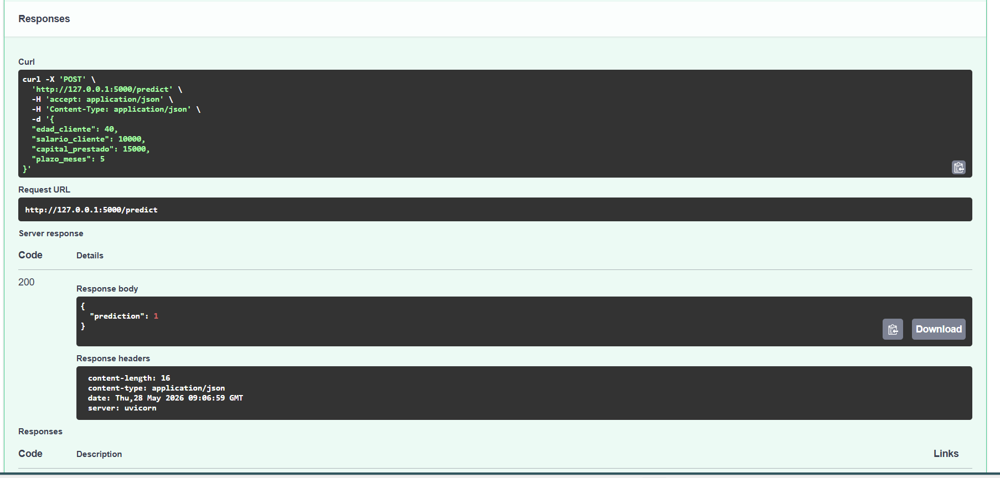

---

# Dockerización del proyecto

Para garantizar portabilidad y reproducibilidad, la API fue empaquetada dentro de un contenedor Docker.

## Construcción de la imagen

```bash
docker build -t pim5-api .
```

### Evidencia de construcción de imagen

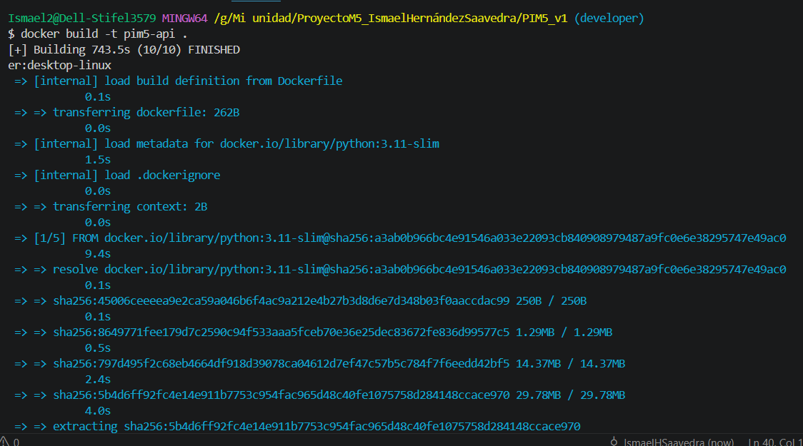

---

## Ejecución del contenedor

```bash
docker run -p 5000:5000 pim5-api
```

### Evidencia de ejecución del contenedor

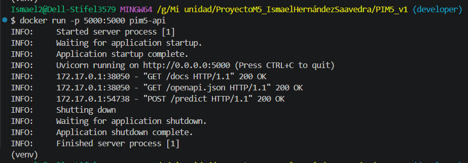

---

# Explicación de mapeo de puertos

## `-p 5000:5000`

Conecta el puerto 5000 del host con el puerto 5000 del contenedor.

Acceso:

```text
http://127.0.0.1:5000
```

---

## `-p 8000:5000`

Permite acceder al contenedor desde el puerto 8000 del host mientras FastAPI continúa ejecutándose en el puerto 5000 interno.

Acceso:

```text
http://127.0.0.1:8000
```

---

# Control de versiones con Git y GitHub

Durante el desarrollo se trabajó utilizando distintas ramas para simular un flujo profesional de trabajo.

Ramas utilizadas:

* `main`
* `developer`
* `docs/readme-final`

También se implementó versionado semántico mediante tags:

* `v1.0.0`
* `v1.0.1`

### Evidencia de ramas utilizadas

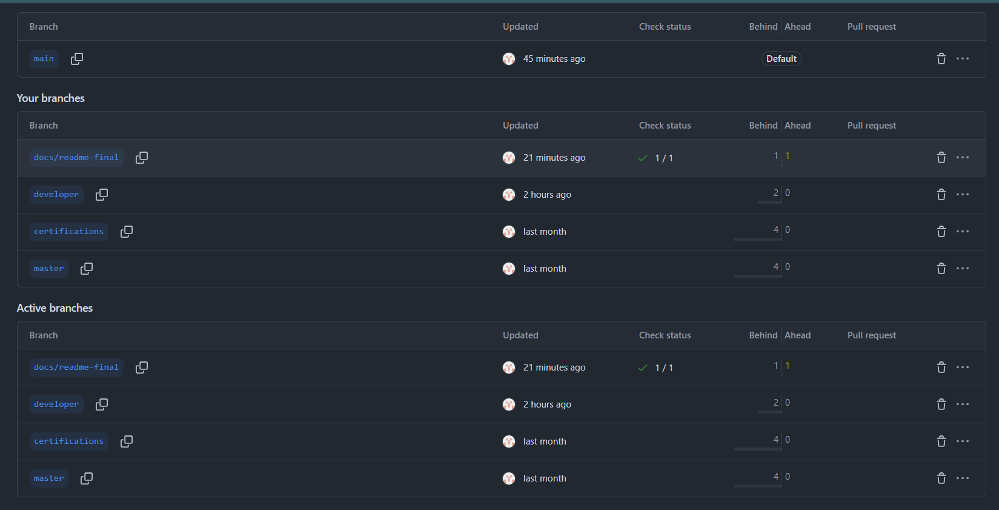

### Evidencia de versionado semántico

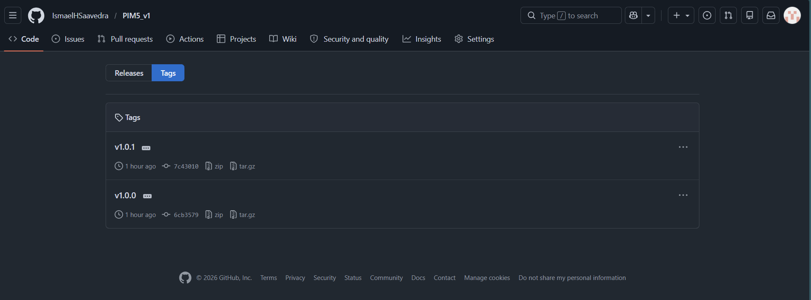

---

# Pull Requests y merges

Como parte del flujo de trabajo, se realizaron Pull Requests para integrar cambios entre ramas antes de fusionarlos a `main`.

### Comparación previa al Pull Request

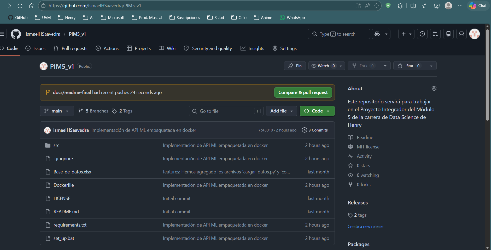

### Confirmación del merge

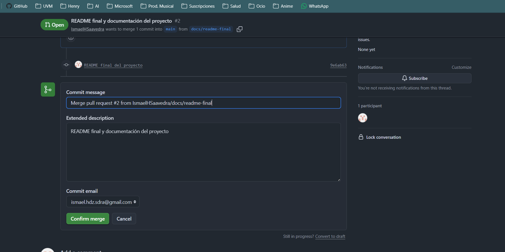

### Pull Request fusionado correctamente

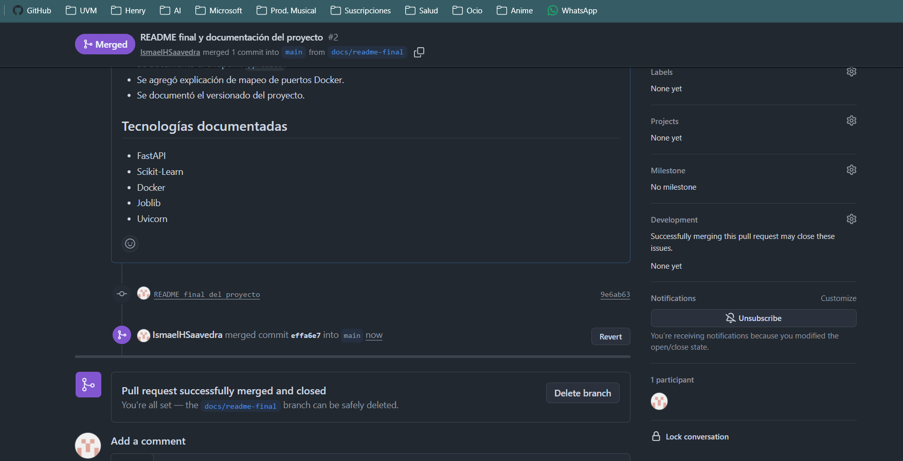

---

# GitHub Actions

Se implementó un workflow básico de CI utilizando GitHub Actions.

El pipeline realiza tareas simples de validación para asegurar que el proyecto pueda ejecutarse correctamente después de cada push.

Archivo utilizado:

```bash
.github/workflows/test.yml
```

### Evidencia de GitHub Actions funcionando

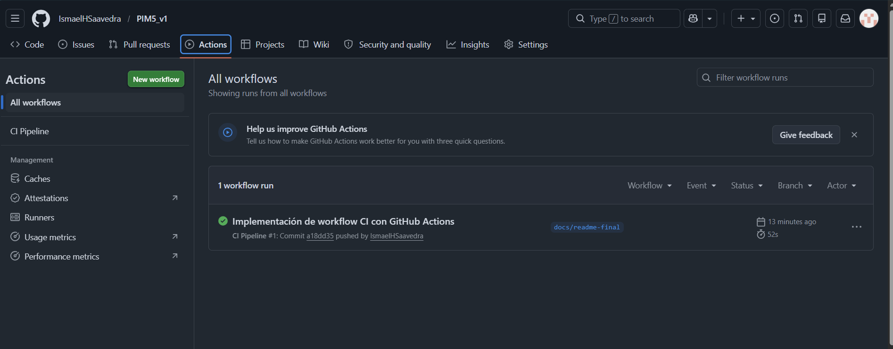

---

# Conclusiones

Durante el desarrollo de este proyecto se logró construir un flujo completo de disponibilización de modelos de Machine Learning utilizando herramientas modernas de desarrollo y despliegue.

Además del modelo predictivo, el proyecto permitió integrar prácticas comunes dentro de entornos profesionales como:

* uso de ramas
* Pull Requests
* versionado semántico
* automatización básica
* empaquetado con Docker
* construcción de APIs

El resultado final es una solución reproducible, portable y preparada para futuras mejoras o despliegues más avanzados.